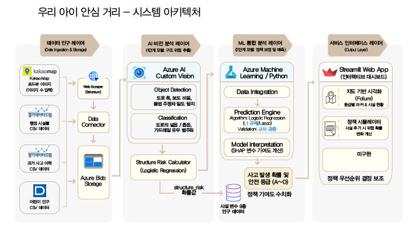

# 스쿨존 안전 분석 대시보드

내 아이가 살기 좋은 동네 — 성남시 142개소 + 광명시 51개소 어린이 보호구역을 안전등급으로 시각화한 데이터 분석 대시보드입니다.

공공데이터로 각 스쿨존의 안전 시설(신호등·과속카메라·CCTV·횡단보도 등)과 사고 이력을 결합해 안전점수를 산출하고, 지도 위에서 어느 스쿨존이 상대적으로 취약한지 한눈에 비교할 수 있게 만들었습니다.

🔗 라이브 데모: https://schoolzone-dashboard-ybojphvjsgnxxx6cfj6uix.streamlit.app

> 경기도 MSAI09 1차 프로젝트 결과물 (팀 협업). 데이터 수집·전처리부터 모델링, 대시보드 배포까지 전체 파이프라인을 담았습니다.

---

<!--
스크린샷 추가하기: 라이브 데모에서 지도 탭과 모델 분석 탭을 캡처해서
docs/screenshot_map.png, docs/screenshot_model.png 로 저장한 뒤,
아래 4줄의 주석(<!-- --\>)만 벗기면 표가 바로 렌더됩니다.

## 스크린샷

| 지도 (안전등급) | 모델 분석 |
| :---: | :---: |
|  |  |

---
-->


## 무엇을 하는가

교통사고 통계는 "어디서 몇 건 났다"까지만 알려주고, 정작 학부모가 궁금한 "우리 동네 스쿨존은 안전한가"는 답해주지 않습니다. 이 프로젝트는 흩어진 공공데이터를 스쿨존 단위로 다시 묶어 다음 질문에 답합니다.

- 우리 동네 스쿨존의 안전점수는 몇 점이고 시 전체에서 어느 수준인가
- 점수를 깎아먹는 요인(부족한 시설·사고 이력)은 무엇인가
- 특정 시설을 보강하면 점수가 얼마나 오르는가 (광명시 시뮬레이션)

---

## 주요 기능 (4개 탭)

| 탭 | 내용 |
| --- | --- |
| 지도 | folium 기반 인터랙티브 지도. 스쿨존별 안전등급을 색으로 표시하고, 시설 오버레이(신호등·과속카메라·CCTV·횡단보도·펜스 등) 토글, 행정동 인구 choropleth, 개별 시설 상세 분석 제공 |
| 시설점수 | 스쿨존별 안전점수 구성(가산점·감산점) 분해와 동네 정보를 함께 표시 |
| 광명 시뮬레이션 | 광명시 51개소에 성남시 모델을 이식해 "시설을 보강하면 점수가 어떻게 바뀌는가" what-if 시뮬레이션 |
| 모델 분석 | 사용한 분류 모델의 성능·피처 중요도 등 모델링 과정 설명 |

지도 UX: MiniMap, 전체화면, 거리 측정 도구, 마커 클러스터링, 상세 팝업 툴팁.

---

## 분석 방법

두 도시에 각각 다른 접근을 적용했습니다.

성남시 (142개소) — 규칙 기반 안전점수 (V6)
- 스쿨존별 보유 안전시설을 가산점으로, 사고 이력·위험 요인을 감산점으로 계산한 해석 가능한 점수 체계

광명시 (51개소) — 머신러닝 기반 위험 추정
- 로드뷰 이미지를 Custom Vision으로 분석해 시설물별 구조위험도(`structure_risk`)를 추출
- `structure_risk` + 시설 피처 + 어린이 인구 비율을 입력으로 사고 발생 여부를 예측하는 이진 분류 모델
- Logistic Regression + L1 피처 선택 + SMOTE(불균형 보정) + Calibration 파이프라인
- 개선 모델(IM) 우선 적용, 미산출 시 성남 모델(V6) fallback

---

## 데이터 출처

전량 공개된 공공데이터를 사용했습니다 (공공누리).

- 도로교통공단 TAAS — 어린이 보호구역 사고다발지역 통계
- 경찰청 / 행정안전부 — 무인 교통단속 카메라, 어린이 보호구역 지정 현황
- 경기데이터드림 — 성남·광명 지역 교통·안전 시설 데이터
- 국토교통부 — 행정동 경계(GeoJSON), 인구 통계
- 로드뷰 이미지 + Azure Custom Vision — 스쿨존 안전시설물 자동 인식

주요 피처: 신호등, 횡단보도, 과속·불법주정차 단속카메라, 생활안전 CCTV, 무단횡단 방지펜스, 옐로카펫, 보호구역 표지판, 아동안전지킴이집, 등하교 시간대 교통량, 연령별 인구.

---

## 기술 스택

- 언어/런타임: Python 3
- 대시보드: Streamlit
- 지도 시각화: folium, streamlit-folium
- 차트: Plotly
- 모델링: scikit-learn (Logistic Regression, SMOTE, Calibration), statsmodels
- 데이터 처리: pandas, numpy
- 배포: Streamlit Community Cloud

---

## 로컬 실행

```bash
# 1. 저장소 클론
git clone https://github.com/wes0031-rgb/schoolzone-dashboard.git
cd schoolzone-dashboard

# 2. 가상환경 (권장)
python -m venv venv
source venv/bin/activate      # Windows: venv\Scripts\activate

# 3. 의존성 설치
pip install -r requirements.txt

# 4. 실행
streamlit run app.py
```

실행 후 브라우저에서 `http://localhost:8501` 로 접속하면 됩니다. 데이터는 `data/` 폴더에 포함되어 있어 별도 준비 없이 바로 동작합니다.

---

## 프로젝트 구조

```
schoolzone-dashboard/
├── app.py              # Streamlit 대시보드 전체 (4개 탭)
├── requirements.txt    # 의존성
├── .streamlit/         # 테마·서버 설정
├── data/               # 전처리 완료된 CSV·GeoJSON·모델 결과·로드뷰
└── docs/               # 제품설계서
```

---

## 시스템 아키텍처



---

## 라이선스

이 저장소의 코드는 MIT 라이선스를 따릅니다. 데이터는 각 제공 기관의 공공누리 이용 조건을 따릅니다.
